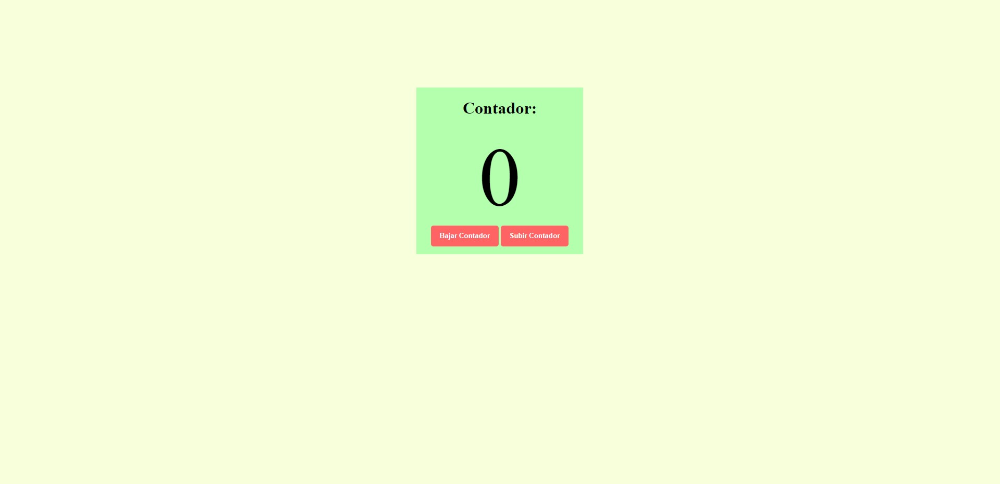

# Counter

*In this project I set out to make an accountant. Which shows on the screen as many negative numbers as positive, enabling the addition and subtraction of 1 with two buttons.*  

### I used

*   Use of flexbox 
*   Creation of events based on buttons selected by DOM

